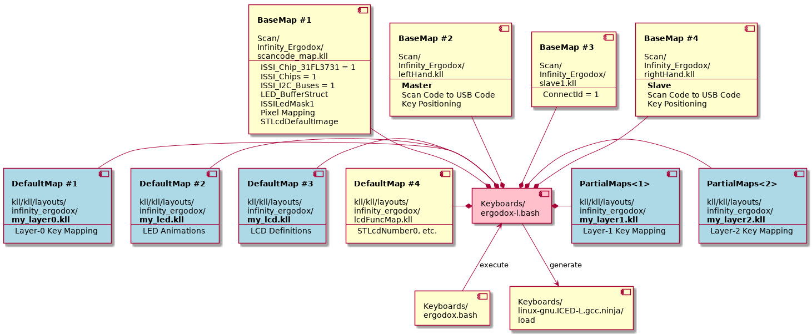
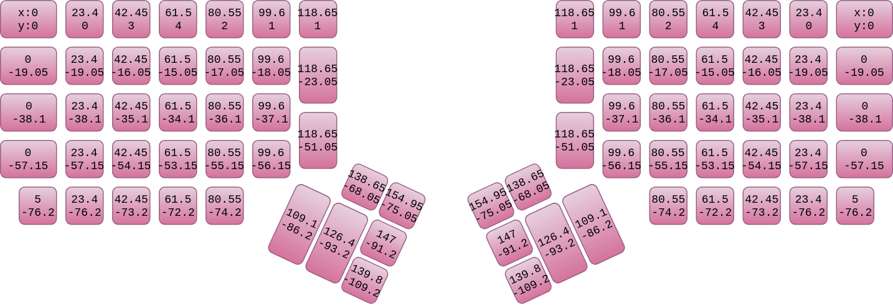
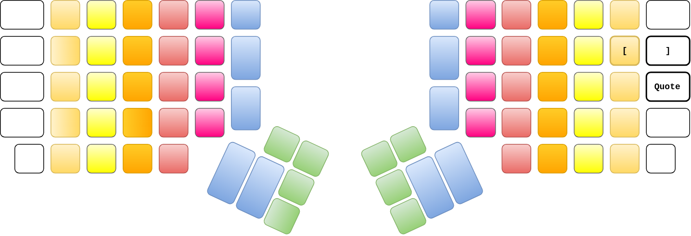
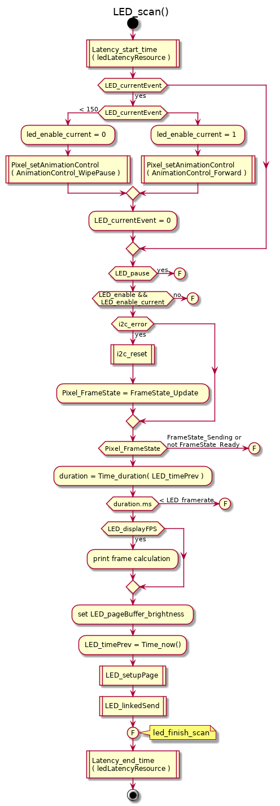
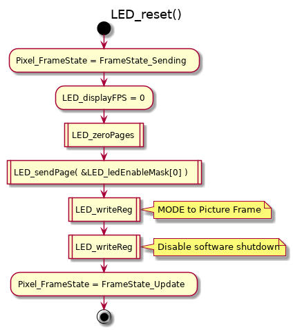
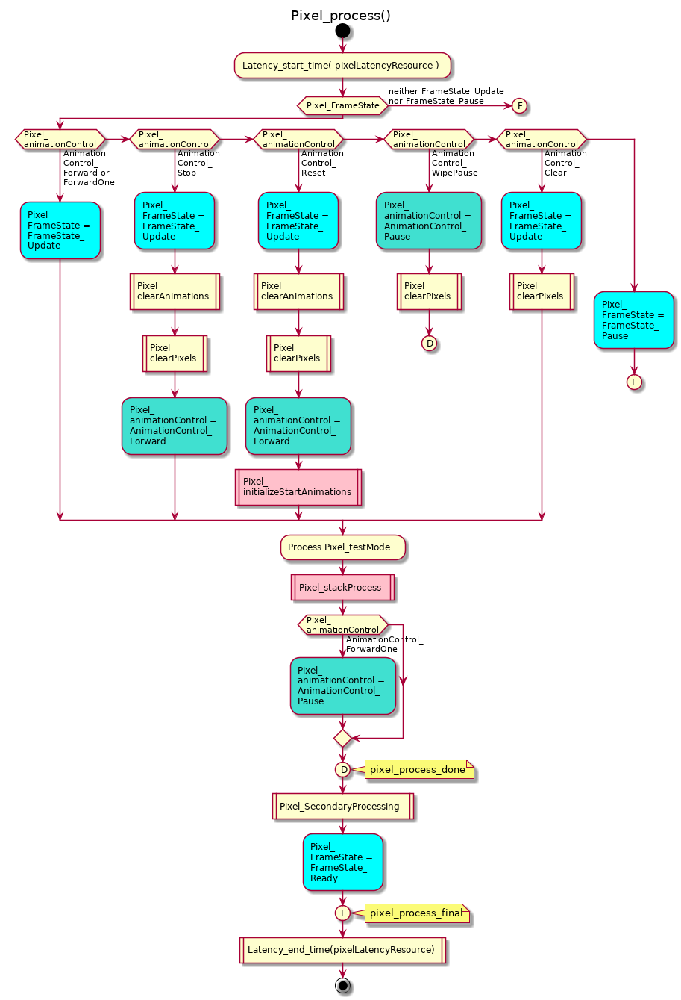
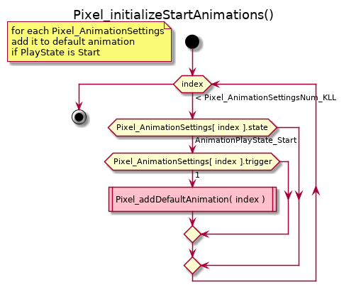
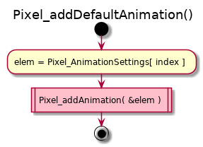
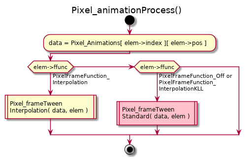

# All about KlueLogic ErgoDox

<!-------------------------------------------------------------------------------->
## Build
<!-------------------------------------------------------------------------------->

### Clone
```bash
cd sandbox
git clone https://github.com/kluelogic/controller.git

cd controller
git clone https://github.com/kluelogic/kll.git
```

### Set the upstream for the fork (do this once)
```bash
cd controller
git remote -v
git remote add upstream https://github.com/kiibohd/controller.git

cd kll
git remote -v
git remote add upstream https://github.com/kiibohd/kll.git
```

### Sync the fork
```bash
cd controller
git remote -v # to make sure upstreams are set like this:

# origin	https://github.com/kluelogic/controller.git (fetch)
# origin	https://github.com/kluelogic/controller.git (push)
# upstream	https://github.com/kiibohd/controller.git (fetch)
# upstream	https://github.com/kiibohd/controller.git (push)

git fetch upstream
git checkout master
git merge upstream/master

cd kll
git remote -v # to make sure upstreams are set like this:

# origin	https://github.com/kluelogic/kll.git (fetch)
# origin	https://github.com/kluelogic/kll.git (push)
# upstream	https://github.com/kiibohd/kll.git (fetch)
# upstream	https://github.com/kiibohd/kll.git (push)

git fetch upstream
git checkout master
git merge upstream/master
```

### Diff
```bash
cd controller
./diff.sh # diff between sandbox/controller and washroom/controller
```

### Build keyboard with Docker
```bash
# build docker (do this once)
cd controller/Dockerfiles
sudo docker build -f Dockerfile.ubuntu -t controller.ubuntu .

# build keyboard
cd controller
sudo docker run -it --rm -v "$(pwd):/controller" controller.ubuntu
pipenv run pip install pip==18.0 # 18.1 won't work
pipenv install
pipenv shell
./ergodox.bash
```

### Load the firmware
```bash
# install dfu-util (do this once)
sudo apt install dfu-util
# sudo apt install screen # not needed

cd controller/Keyboards/linux-gnu.ICED-L.gcc.ninja
sudo ./load
# click the reset button in the back
```



<!-------------------------------------------------------------------------------->
## Firmware
<!-------------------------------------------------------------------------------->

### Main function (`main.c`)


### Scan loop (`Scan/Infinity_Ergodox/scan_loop.c`)


<!-------------------------------------------------------------------------------->
## Keyboard Layout
<!-------------------------------------------------------------------------------->

### Keyboard Layout Language
[KLL Spec](https://github.com/kiibohd/kll-spec)

### ErgoDox Switch ID


### Scan Code


### Pixel Mapping (`Scan/Infinity_Ergodox/scancode_map.kll`)


### Pixel Row/Column


### Key Positioning (`Scan/Infinity_Ergodox/leftHand.kll` and `rightHand.kll`)


### USB Code (`Scan/Infinity_Ergodox/leftHand.kll` and `rightHand.kll`)


### Layer 0 (`kll/kll/layouts/infinity_ergodox/my_layer0.kll`)
Deviation from the original ErgoDox layout is shown in _**bold italic**_.


### Layer 1 (`kll/kll/layouts/infinity_ergodox/my_layer1.kll`)
This layer pulls in the overflowed keys of layer 0. Deviation from the original ErgoDox layout is shown in _**bold italic**_.

NOTE: **List all keys in relation to the original ErgoDox layout**, not in relation to my layer 0.



### Layer 2 (`kll/kll/layouts/infinity_ergodox/my_layer2.kll`)
This layer is for register programming. A key press increments the value of corresponding register.


<!-------------------------------------------------------------------------------->
## LED
<!-------------------------------------------------------------------------------->

### Macros

Macro                       | Value     
--------------------------- | ----------
`_kinetis_`                 | undefined?
`_sam_`                     | undefined?
`_sam4s_`                   | undefined?
`_sam4s_a_`                 | undefined?
`DEBUG_RESETS`              | undefined?
`SEGGER_SYSVIEW_H`          | undefined?
`Storage_Enable_define`     | 0?        

#### `Keyboards/linux-gnu.ICED-L.gcc.ninja/kll_defs.h`
```C
#define ISSI_Chip_31FL3731_define 1
#define ISSI_Chip_31FL3732_define 0
#define ISSI_Chip_31FL3733_define 0
#define ISSI_Chips_define         1
#define ISSI_Global_Brightness_define 255
#define ISSILedMask1_define\
	0xFF, 0x00, /* C1-1 -> C1-16 */\
	0xFF, 0x00, /* C2-1 -> C2-16 */\
	0xFF, 0x00, /* C3-1 -> C3-16 */\
	0xFF, 0x00, /* C4-1 -> C4-16 */\
	0x3F, 0x00, /* C5-1 -> C5-16 */\
	0x00, 0x00, /* C6-1 -> C6-16 */\
	0x00, 0x00, /* C7-1 -> C7-16 */\
	0x00, 0x00, /* C8-1 -> C8-16 */\
	0x00, 0x00, /* C9-1 -> C9-16 */\

#define LED_MapCh1_Addr_define ISSI_Ch1
#define LED_MapCh1_Bus_define  0       
```

#### `Scan/Devices/ISSILed/led_scan.c`
```C
#define ISSI_Ch1              0xE8
#define ISSI_ConfigPage       0x0B // Function Register
#define ISSI_ConfigPageLength 0x0C
#define ISSI_LEDPages         8
#define ISSI_PageLength       0xB4

#define LED_BufferLength      144
```

### Typedefs
#### `Scan/Devices/ISSILed/led_scan.c`
```C
typedef struct LED_ChannelMap {
  uint8_t bus;
  uint8_t addr;
} LED_ChannelMap;
```

### Constants
#### `Scan/Devices/ISSILed/led_scan.c`
```C
const LED_ChannelMap   LED_ChannelMapping[1] = { { 0, 0xE8 } }; // { I2C bus number, I2C address }
const LED_EnableBuffer LED_ledEnableMask [1] = {
   { 0xE8, 0x00, /* I2C address, Starting register address */ { ISSILedMask1_define } } }; 
```

### Functions
#### `Scan/Devices/ISSILed/led_scan.c`
```C
void LED_sendPage ( uint8_t bus, uint8_t addr, uint16_t *buffer, uint32_t len, uint8_t page )
void LED_setupPage( uint8_t bus, uint8_t addr, uint8_t page )
void LED_writeReg ( uint8_t bus, uint8_t addr, uint8_t reg, uint8_t val, uint8_t page )
void LED_zeroControlPages()
void LED_zeroPages( uint8_t bus, uint8_t addr, uint8_t startPage, uint8_t numPages,
                    uint8_t startReg, uint8_t endReg )
```

### Control Registers


### LED scan (`Scan/Devices/ISSILed/led_scan.c`)




<!-------------------------------------------------------------------------------->
## LCD
<!-------------------------------------------------------------------------------->

<!-------------------------------------------------------------------------------->
## Pixel
<!-------------------------------------------------------------------------------->

### Macros

#### `Keyboards/linux-gnu.ICED-L.gcc.ninja/kll_defs.h`
```C
#define Animation__<NAME> 0
#define Pixel_AnimationSettingsNum_KLL 1
#define Pixel_AnimationStackSize_define 20
```

#### `Macro/PixelMap/pixel.h`
```C
#define Pixel_AnimationStackSize Pixel_AnimationStackSize_define
```

### Typedefs
#### `Macro/PartialMap/kll.h`
```C
typedef struct TriggerMacro {
  const uint8_t *guide;
  const var_uint_t result;
} TriggerMacro;
```

#### `Macro/PixelMap/pixel.h`
```C
typedef enum PixelFrameOption {
  PixelFrameOption_None         = 0, // No options set
  PixelFrameOption_FrameStretch = 1, // During frame delay frames, re-run animation frame
} PixelFrameOption;

typedef enum PixelFrameFunction {
  PixelFrameFunction_Off = 0,
  PixelFrameFunction_Interpolation,
  PixelFrameFunction_InterpolationKLL,
} PixelFrameFunction;

typedef enum PixelPixelFunction {
  PixelPixelFunction_Off = 0,
  PixelPixelFunction_PointInterpolation,
  PixelPixelFunction_PointInterpolationKLL,
} PixelPixelFunction;

typedef enum AnimationReplaceType {
  AnimationReplaceType_None  = 0, // Don't replace (add new animation to stack if not full)
  AnimationReplaceType_Basic = 1, // Replace only if the same trigger initiated
  AnimationReplaceType_All   = 2, // Replace no matter what trigger initiated
  AnimationReplaceType_State = 3, // Using same trigger, start on Activate/Press, stop on Deactivate/Release
  AnimationReplaceType_Clear = 4, // Clear all other animations before addi
} AnimationReplaceType;
 
typedef enum AnimationPlayState {
  AnimationPlayState_Start  = 0, // Start animation
  AnimationPlayState_Pause  = 1, // Pause animation (default set by KLL Compiler)
  AnimationPlayState_Stop   = 2, // Stop animation (removes animation state)
  AnimationPlayState_Single = 3, // Play a single frame of the animation
} AnimationPlayState;

typedef struct AnimationStackElement {
  TriggerMacro        *trigger;     // TriggerMacro that added element, set to 0 if unused
                                    // If set to 1 in default settings, animation is enabled at start time
  uint16_t             index;       // Animation id
  uint16_t             pos;         // Current fundamental frame (XXX Make 32bit?)
  uint8_t              subpos;      // If framedelay is set, current delay position
                                    // Counts down up to framedelay.
  uint8_t              loops;       // # of loops to run animation, 0 indicates infinite
  uint8_t              framedelay;  // # of frames to delay the animation per frame of the animation
                                    // 0 - Full speed
                                    // 1 - Half speed
                                    // 2 - 1/3  speed
                                    // etc.
  PixelFrameOption     frameoption; // Frame processing options
  PixelFrameFunction   ffunc;       // Frame tweening function
  PixelPixelFunction   pfunc;       // Pixel tweening function
  AnimationReplaceType replace;     // Replace type for stack element
  AnimationPlayState   state;       // Animation state
} AnimationStackElement;

typedef struct AnimationStack {
  int16_t size;
  AnimationStackElement *stack[Pixel_AnimationStackSize];
} AnimationStack;

typedef enum PixelChange {
  PixelChange_Set = 0,         // =
  PixelChange_Add,             // +
  PixelChange_Subtract,        // -
  PixelChange_NoRoll_Add,      // +:
  PixelChange_NoRoll_Subtract, // -:
  PixelChange_LeftShift,       // <<
  PixelChange_RightShift,      // >>
} PixelChange;

typedef struct PixelRect {
  int16_t col;
  int16_t row;
} PixelRect;

typedef struct PixelModElement {
  PixelAddressType type; // Address type
  union {
    PixelRect rect; // Rectangle lookup for column, row and row vs. col
    int32_t  index; // Index lookup for direct and scancode lookups
  };
  uint8_t data[0]; // Data size depends on PixelElement definition
                   // ( PixelElement.width / 8 + sizeof(PixelChange) ) * PixelElement.channels
} __attribute__((packed)) PixelModElement;
```

### Constants
#### `Keyboards/linux-gnu.ICED-L.gcc.ninja/generatedPixelmap.c`
```C
// A[<NAME>] <= start, pfunc:interp;

const AnimationStackElement Pixel_AnimationSettings[] = {
  { (TriggerMacro*)1,        // trigger
    Animation__<NAME>,       // index (0)
    0,                       // pos
    0,                       // subpos
    0,                       // loops (infinite)
    0,                       // framedelay (full speed)
    PixelFrameOption_None,   // frameoption
    0,                       // ffunc
    1,                       // pfunc (point interpolation)
    0,                       // replace
    AnimationPlayState_Start // state
  },
};

const uint8_t **Pixel_Animations[] = {
  /*0*/ <NAME>_frames,
};

const uint8_t *<NAME>_frames[] = {
  <NAME>_frame1,
  0
};

// A[<NAME>, 1] <= P[c:0%](255), P[c:100%](255);

const uint8_t <NAME>_frame1[] = {
  PixelAddressType_ColumnFill, /*0.0*/ 0,0, /*None*/0,0, PixelChange_Set, 255,
  PixelAddressType_ColumnFill, /*1.0*/16,0, /*None*/0,0, PixelChange_Set, 255,
  PixelAddressType_End
};
```

### Examples
#### `kll/kll/layouts/animation_test.kll`

### Pixel (`Macro/PixelMap/pixel.c`)









<!-------------------------------------------------------------------------------->
## Tools
<!-------------------------------------------------------------------------------->

### Doxygen
```bash
cd controller/doc
make html # then open html/index.html
```

### UML
```bash
cd controller/doc # edit uml/*.uml if necessary
make uml
```

### Markdown previewer
#### [Dillinger](https://dillinger.io/) - won't show images
#### [grip](https://github.com/joeyespo/grip)
```bash
sudo apt install grip
grip KLUELOGIC_ERGODOX.md # then open http://localhost:6419
```

### File diff and merge - `meld`