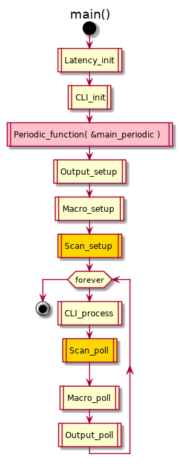
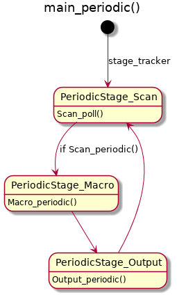
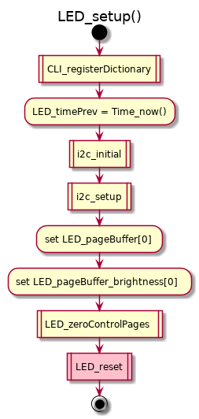

# All about KlueLogic ErgoDox

## Clone
```bash
cd sandbox
git clone https://github.com/kluelogic/controller.git

cd controller
git clone https://github.com/kluelogic/kll.git
```

## Set the upstream for the fork (do this once)
```bash
cd controller
git remote -v
git remote add upstream https://github.com/kiibohd/controller.git

cd kll
git remote -v
git remote add upstream https://github.com/kiibohd/kll.git
```

## Sync the fork
```bash
cd controller
git remote -v # to make sure upstreams are set like this:

# origin	https://github.com/kluelogic/controller.git (fetch)
# origin	https://github.com/kluelogic/controller.git (push)
# upstream	https://github.com/kiibohd/controller.git (fetch)
# upstream	https://github.com/kiibohd/controller.git (push)

git fetch upstream
git checkout master
git merge upstream/master

cd kll
git remote -v # to make sure upstreams are set like this:

# origin	https://github.com/kluelogic/kll.git (fetch)
# origin	https://github.com/kluelogic/kll.git (push)
# upstream	https://github.com/kiibohd/kll.git (fetch)
# upstream	https://github.com/kiibohd/kll.git (push)

git fetch upstream
git checkout master
git merge upstream/master
```

## Diff
```bash
cd controller
./diff.sh
```

## Build keyboard with Docker
```bash
# build docker (do this once)
cd controller/Dockerfiles
sudo docker build -f Dockerfile.ubuntu -t controller.ubuntu .

# build keyboard
cd controller
sudo docker run -it --rm -v "$(pwd):/controller" controller.ubuntu
pipenv run pip install pip==18.0 # 18.1 won't work
pipenv install
pipenv shell
./ergodox.bash
```


## Keyboard Layout Language

[KLL Spec](https://github.com/kiibohd/kll-spec)

## Keyboard Layout

### ErgoDox Switch ID


### Scan Code


### Pixel Mapping (`Scan/Infinity_Ergodox/scancode_map.kll`)


### Key Positioning (`Scan/Infinity_Ergodox/leftHand.kll` and `rightHand.kll`)


### USB Code (`Scan/Infinity_Ergodox/leftHand.kll` and `rightHand.kll`)


### Layer 0 (`kll/kll/layouts/infinity_ergodox/my_layer0.kll`)
Deviation from the original ErgoDox layout is shown in _**bold italic**_.


### Layer 1 (`kll/kll/layouts/infinity_ergodox/my_layer1.kll`)
This layer pulls in the overflowed keys of layer 0. Deviation from the original ErgoDox layout is shown in _**bold italic**_.

NOTE: **List all keys in relation to the original ErgoDox layout**, not in relation to my layer 0.


### Layer 2 (`kll/kll/layouts/infinity_ergodox/my_layer2.kll`)
This layer is for register programming. A key press increments the value of corresponding register.


## LED
### Macros

Macro                       | Value     
--------------------------- | ----------
`_kinetis_`                 | undefined?
`_sam_`                     | undefined?
`_sam4s_`                   | undefined?
`_sam4s_a_`                 | undefined?
`DEBUG_RESETS`              | undefined?
`SEGGER_SYSVIEW_H`          | undefined?
`Storage_Enable_define`     | 0?        

#### `Keyboards/linux-gnu.ICED-L.gcc.ninja/kll_defs.h`
```C
#define ISSI_Chip_31FL3731_define 1
#define ISSI_Chip_31FL3732_define 0
#define ISSI_Chip_31FL3733_define 0
#define ISSI_Chips_define         1
#define ISSILedMask1_define 0xFF,0x00,0xFF,0x00,0xFF,0x00,\
                            0xFF,0x00,0x3F,0x00,0x00,0x00,\
			    0x00,0x00,0x00,0x00,0x00,0x00

#define LED_MapCh1_Addr_define ISSI_Ch1
#define LED_MapCh1_Bus_define  0       
```

#### `Scan/Devices/ISSILed/led_scan.c`
```C
#define ISSI_Ch1        0xE8
#define ISSI_LEDPages   8
#define ISSI_PageLength 0xB4
```

### Typedefs
#### `Scan/Devices/ISSILed/led_scan.c`
```C
typedef struct LED_ChannelMap {
   uint8_t bus;
   uint8_t addr;
} LED_ChannelMap;
```

### Constants
#### `Scan/Devices/ISSILed/led_scan.c`
```C
const LED_ChannelMap LED_ChannelMapping[1] = { { 0, 0xE8 } }; // { I2C bus number, I2C address }
const LED_EnableBuffer LED_ledEnableMask[1] = { { 0xE8, 0x00, // { I2C address, Starting register address, ...
                                                { ISSILedMask1_define } } }; 
```

### Functions
#### `Scan/Devices/ISSILed/led_scan.c`
```C
void LED_zeroPages( uint8_t bus, uint8_t addr, uint8_t startPage, uint8_t numPages, uint8_t startReg, uint8_t endReg );
void LED_sendPage( uint8_t bus, uint8_t addr, uint16_t *buffer, uint32_t len, uint8_t page );
```

## Firmware

### Main function (`main.c`)



### Scan loop (`Scan/Infinity_Ergodox/scan_loop.c`)


### LED scan (`Scan/Devices/ISSILed/led_scan.c`)



## Tools

### Doxygen
```bash
cd doc
make html # then open html/index.html
```

### UML
```bash
cd doc # edit uml/*.uml if necessary
make uml
```

### Markdown previewer
#### [Dillinger](https://dillinger.io/) - won't show images
#### [grip](https://github.com/joeyespo/grip)
```bash
sudo apt install grip
grip KLUELOGIC_ERGODOX.md # then open http://localhost:6419
```

### File diff and merge - `meld`