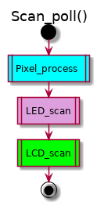

# All about KlueLogic ErgoDox

## Keyboard Layout

### Layer 0 (`kll/layouts/my_config.kll`)
Deviation from the original ErgoDox layout is shown in _**bold italic**_.


### Layer 1 (`kll/layouts/my_layer1.kll`)
This layer pulls in the overflowed keys of layer 0. Deviation from the original ErgoDox layout is shown in _**bold italic**_.

NOTE: **List all keys in relation to the original ErgoDox layout**, not in relation to my layer 0.


### Layer 2 (`kll/layouts/my_layer2.kll`)
This layer is for register programming. A key press increments the value of corresponding register.


## Firmware
### Main function (`main.c`)


### Scan loop (`Scan/Infinity_Ergodox/scan_loop.c`)



### LED scan (`Scan/Devices/ISSILed/led_scan.c`)


## Tools

### Doxygen
```bash
cd doc
make html # then open html/index.html
```

### UML
```bash
cd doc # edit uml/*.uml if necessary
make uml
```

### Markdown previewer
#### [Dillinger](https://dillinger.io/) - won't show images
#### [grip](https://github.com/joeyespo/grip)
```bash
sudo apt install grip
grip README_FIRST.md # then open http://localhost:6419
```

### File diff and merge - `meld`